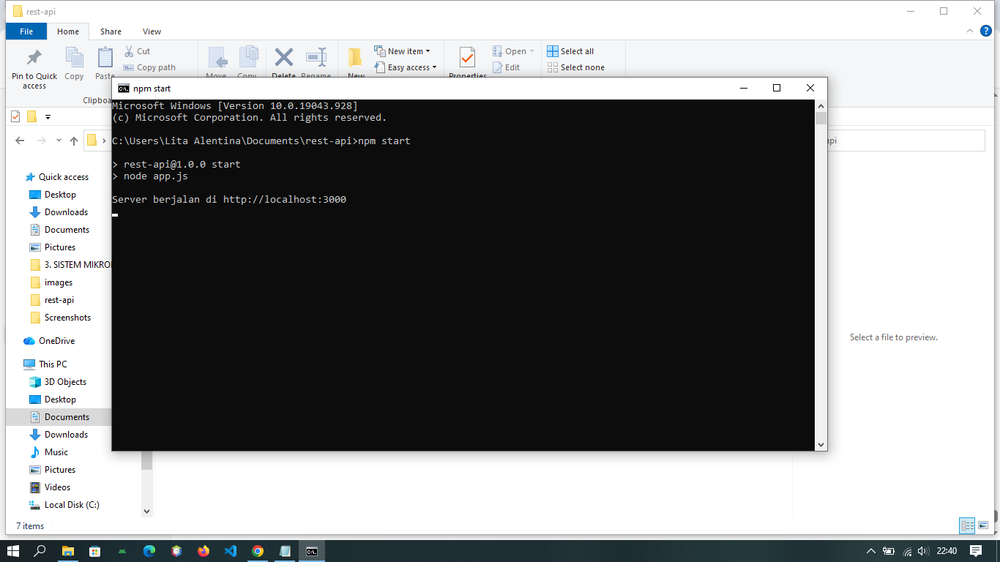
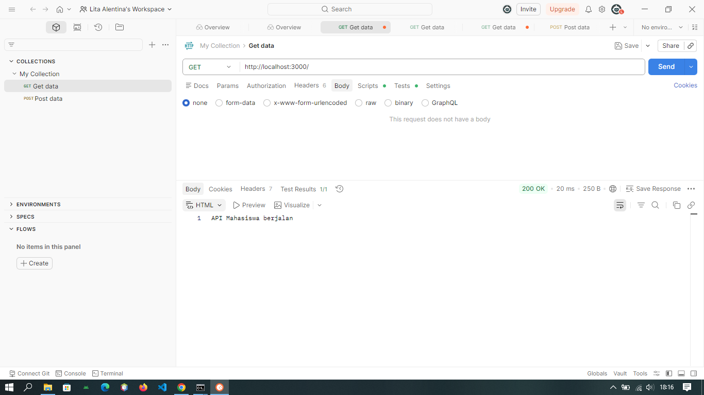
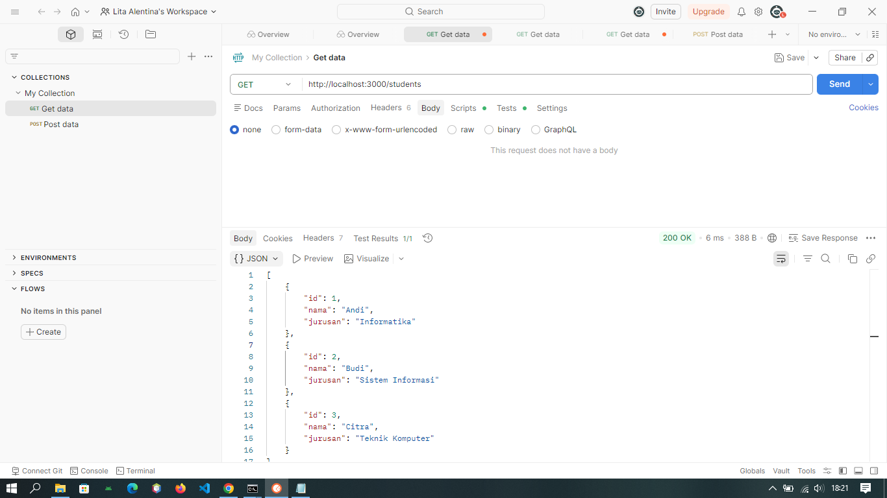
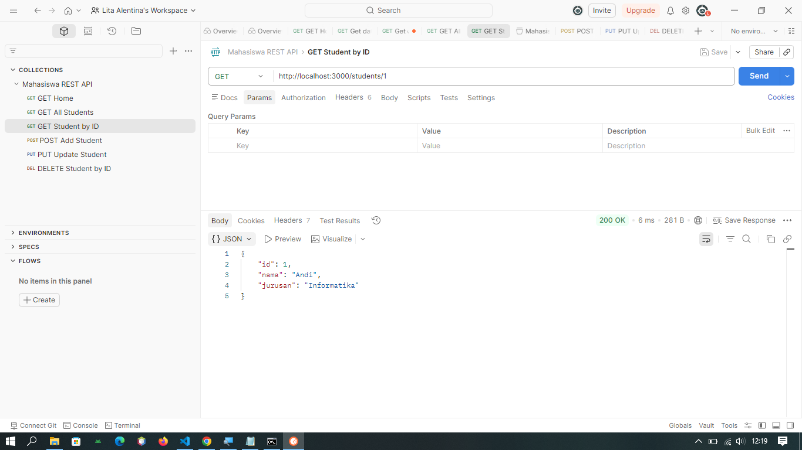
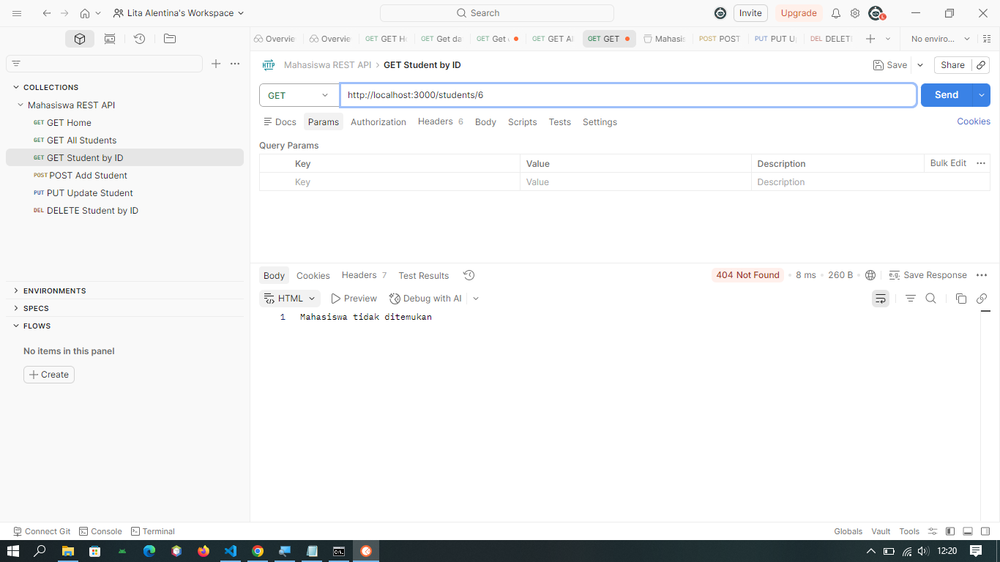
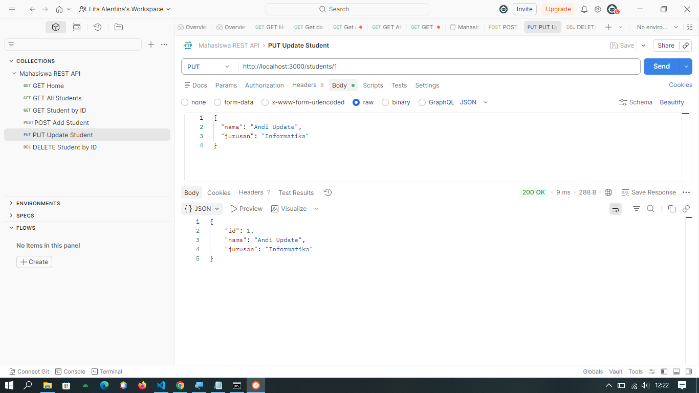
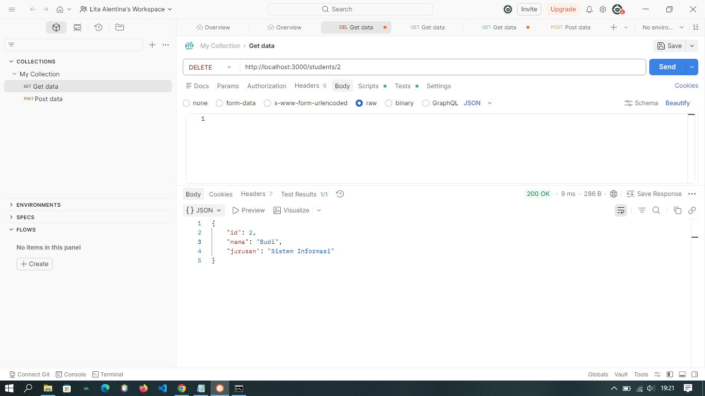
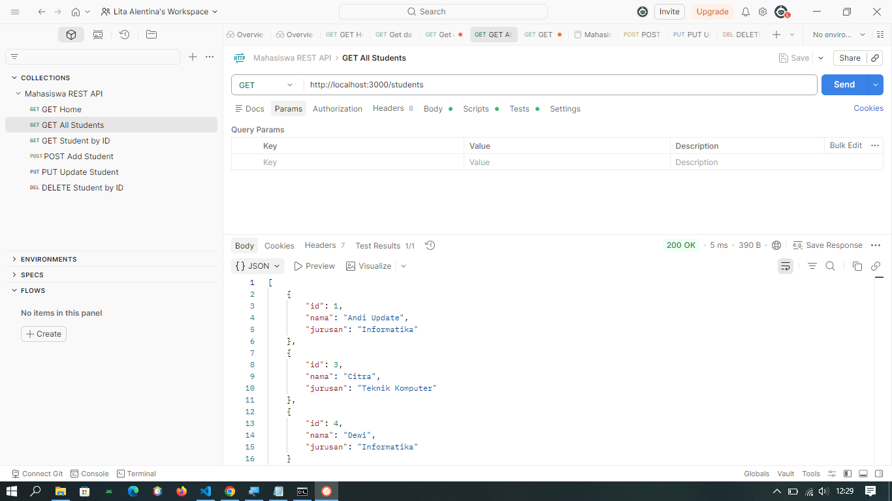

# REST API Mahasiswa

Project ini merupakan implementasi REST API sederhana menggunakan Node.js dan Express.js dengan data dummy (array) tanpa database.

---

## ▶️ Cara Menjalankan Project

1. Buka terminal / CMD
2. Masuk ke folder project:

```
cd rest-api
```

3. Install dependency:

```
npm install
```

4. Jalankan server:

```
npm start
```

5. Server akan berjalan di:

```
http://localhost:3000
```

---

## 📸 Screenshot Menjalankan Server




---

## 📡 Endpoint API

### 1. Home

**GET /**
Response:

```
API Mahasiswa berjalan
```


---

### 2. GET Semua Mahasiswa

**GET /students**

Response:

```json
[
  {
    "id": 1,
    "nama": "Andi",
    "jurusan": "Informatika"
  },
  {
    "id": 2,
    "nama": "Budi",
    "jurusan": "Sistem Informasi"
  },
  {
    "id": 3,
    "nama": "Citra",
    "jurusan": "Teknik Komputer"
  }
]
```



---

### 3. GET Mahasiswa Berdasarkan ID

**GET /students/:id**

Contoh:

```
/students/1
```

Response:

```
{
    "id": 1,
    "nama": "Andi",
    "jurusan": "Informatika"
}
```




Tampilan Response jika data tidak ada:

```
Mahasiswa tidak ditemukan
```




---

### 4. POST Tambah Mahasiswa

**POST /students**

Body JSON:

```json
{
  "nama": "Dewi",
  "jurusan": "Informatika"
}
```


---

### 5. PUT Update Mahasiswa

**PUT /students/:id**

Body JSON:

```json
{
  "nama": "Andi Update",
  "jurusan": "Informatika"
}
```



---

### 6. DELETE Mahasiswa

**DELETE /students/:id**

Contoh:

```
DELETE /students/2
```





---

## 💻 Penjelasan Kode

### 1. Import dan Inisialisasi Express

```javascript
const express = require("express");
const app = express();
const PORT = 3000;
```

Kode ini digunakan untuk mengimpor framework Express.js dan membuat instance aplikasi server.
Port **3000** digunakan sebagai tempat server berjalan.

---

### 2. Middleware

```javascript
app.use(express.json());
```

Middleware ini berfungsi untuk membaca data **JSON** dari request body, terutama saat menggunakan metode **POST** dan **PUT**.

---

### 3. Data Dummy

```javascript
let students = [
  { id: 1, nama: "Andi", jurusan: "Informatika" },
  { id: 2, nama: "Budi", jurusan: "Sistem Informasi" },
  { id: 3, nama: "Citra", jurusan: "Teknik Komputer" },
];
```

Data mahasiswa disimpan dalam bentuk array (tanpa database).
Data ini akan digunakan untuk proses **CRUD (Create, Read, Update, Delete)**.

---

### 4. Endpoint Home

```javascript
app.get("/", (req, res) => {
  res.send("API Mahasiswa berjalan");
});
```

Endpoint ini digunakan untuk mengecek apakah server berjalan dengan baik.
Jika diakses, akan menampilkan pesan:

```
API Mahasiswa berjalan
```

---

### 5. GET Semua Mahasiswa

```javascript
app.get("/students", (req, res) => {
  res.json(students);
});
```

Endpoint ini digunakan untuk menampilkan seluruh data mahasiswa dalam format JSON.

---

### 6. GET Mahasiswa Berdasarkan ID

```javascript
app.get("/students/:id", (req, res) => {
  const id = parseInt(req.params.id);
  const student = students.find((s) => s.id === id);

  if (!student) {
    return res.status(404).send("Mahasiswa tidak ditemukan");
  }

  res.json(student);
});
```

* Mengambil parameter `id` dari URL
* Mencari data mahasiswa berdasarkan ID
* Jika tidak ditemukan → menampilkan pesan error
* Jika ditemukan → menampilkan data mahasiswa

---

### 7. POST (Tambah Data Mahasiswa)

```javascript
app.post("/students", (req, res) => {
  const { nama, jurusan } = req.body;

  const newStudent = {
    id: students.length + 1,
    nama,
    jurusan,
  };

  students.push(newStudent);

  res.json(newStudent);
});
```

Digunakan untuk menambahkan data mahasiswa baru:

* Data diambil dari body request (JSON)
* ID dibuat otomatis
* Data disimpan ke array `students`

---

### 8. PUT (Update Data Mahasiswa)

```javascript
app.put("/students/:id", (req, res) => {
  const id = parseInt(req.params.id);
  const { nama, jurusan } = req.body;

  const index = students.findIndex((s) => s.id === id);

  if (index === -1) {
    return res.status(404).send("Mahasiswa tidak ditemukan");
  }

  students[index] = { id, nama, jurusan };

  res.json(students[index]);
});
```

Digunakan untuk mengubah data mahasiswa:

* Mencari data berdasarkan ID
* Jika tidak ditemukan → error
* Jika ditemukan → data diperbarui

---

### 9. DELETE (Hapus Data Mahasiswa)

```javascript
app.delete("/students/:id", (req, res) => {
  const id = parseInt(req.params.id);

  const index = students.findIndex((s) => s.id === id);

  if (index === -1) {
    return res.status(404).send("Mahasiswa tidak ditemukan");
  }

  const deleted = students.splice(index, 1);

  res.json(deleted[0]);
});
```

Digunakan untuk menghapus data mahasiswa:

* Mencari data berdasarkan ID
* Menghapus dari array
* Mengembalikan data yang dihapus

---

### 10. Menjalankan Server

```javascript
app.listen(PORT, () => {
  console.log(`Server berjalan di http://localhost:${PORT}`);
});
```

Kode ini digunakan untuk menjalankan server pada port **3000**.
Jika berhasil, akan muncul pesan di terminal:

```
Server berjalan di http://localhost:3000
```

---

## 📌 Deskripsi

API ini dibuat untuk mengelola data mahasiswa dengan fitur:

* Menampilkan semua data mahasiswa
* Menampilkan data berdasarkan ID
* Menambahkan data mahasiswa
* Mengupdate data mahasiswa
* Menghapus data mahasiswa

---

## 🛠️ Teknologi

* Node.js
* Express.js

---

## 📁 Struktur Project

```
rest-api
├── images
├── app.js
├── package.json
├── package-lock.json
├── README.md
└── .gitignore
```

---

## Kesimpulan

Project ini berhasil membuat REST API sederhana menggunakan Express.js dengan fitur CRUD (Create, Read, Update, Delete) dan telah diuji menggunakan Postman.

---


Lita Alentina
23552011097
TIF K 23B
